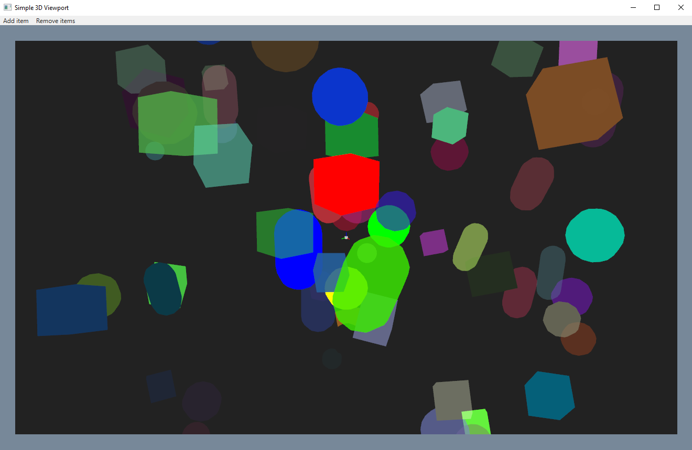

# Simple 3D Viewport

Made by: Osdanova

This is a sample project that adds the Simple3DViewport_Control to WPF. This was originally made for the [OpenKH](https://github.com/OpenKH/OpenKh) project and I'm now storing it separately to be able to reuse it when needed.

## Features

* Add models to the viewport and simply call render() to render them in the viewport
* Make them visible / invisible or remove them via Ids or Labels
* Create some basic geometric shapes: Cuboids, spheres and capsules
* Camera controls: Left click to rotate, right click to move and wheel to zoom in and out
* The default lightning is a white ambient light to be able to see the models clearly

## Sample app

This project contains a sample app that displays a group of objects and more can be added in random shapes, positions and colors.
Check "MainWindow.xaml.cs" to see how the control is used.

